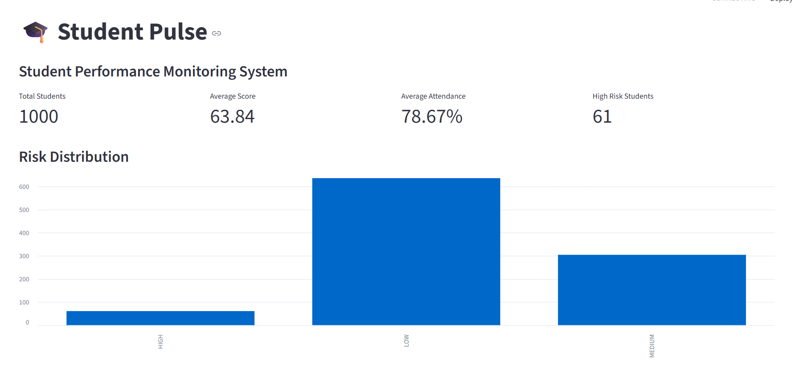

\# 📊 Student-Pulse


Student-Pulse is a Python-based student analytics and academic risk monitoring system. It analyzes student academic and behavioral data to identify performance patterns and help detect students who may need academic support.


\## 🎯 Project Objective


The goal of Student-Pulse is to transform student data into useful insights by analyzing factors such as:


\- Study hours

\- Attendance

\- Assignment completion

\- Quiz performance

\- Sleep hours

\- Phone usage

\- DSA practice

\- Days remaining before exams

\- Final academic score


The system uses these factors to analyze academic performance and identify students who may be at risk.


\## 🚀 Features


\- 📊 Student data analysis

\- 📈 Academic performance statistics

\- 🔎 Correlation analysis

\- ⚠️ Student risk identification

\- 👤 Individual student profiles

\- 📱 Interactive dashboard

\- 📁 Synthetic student dataset generation

\- 🧪 Testing support

## 📸 Dashboard Preview

The Student-Pulse dashboard provides an interactive view of student performance, academic indicators, and risk-related insights.



\## 🛠️ Technologies Used


\- \*\*Python\*\*

\- \*\*Pandas\*\*

\- \*\*NumPy\*\*

\- \*\*Streamlit\*\*

\- \*\*Matplotlib\*\*

\- \*\*Seaborn\*\*

\- \*\*CSV\*\*

\- \*\*Git \& GitHub\*\*


\## 📁 Project Structure


```text

Student-Pulse/

│

├── data/

│   ├── students\_random\_50.csv

│   ├── students\_synthetic\_1000.csv

│   └── students\_with\_risk.csv

│

├── notebooks/

│

├── src/

│   ├── dashboard.py

│   ├── data\_analysis.py

│   ├── generate\_data.py

│   ├── risk\_engine.py

│   ├── student\_profile.py

│   └── test\_dashboard.py

│

├── .gitignore

├── README.md

└── requirements.txt

